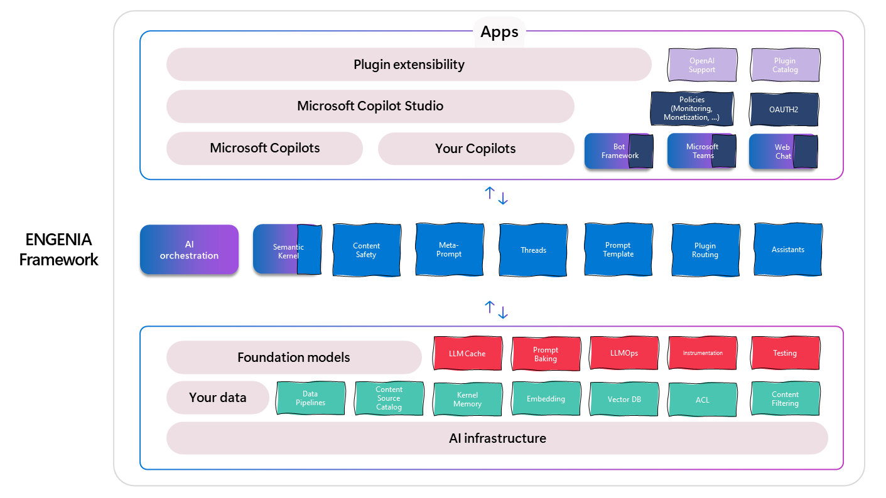

# ENMARCHA (Your package to accelerate .NET projects)

> :warning: **This project is still under development.** We're working hard to release the first version of ENMARCHA as soon as possible. Stay tuned! Documentation and code examples will be available soon.

ENMARCHA aims to speed up the development of various .NET applications by leveraging robust modules that integrate with popular services and frameworks.

## Overview

## Key Features

ENMARCHA is a collection of modules that can be used to accelerate the development of various .NET applications. Each module is designed to integrate with popular services and frameworks, and can be used independently or in combination with other modules.

In terms of Generative AI, ENMARCHA implement ENGENIA as a core component to help with the develop of Generative AI applications in .NET. ENGENIA is based on the Microsoft Semantic Kernel and it's based of differente modules to help implement all the stacks of a Copilot application.

## 🚀 Core Components from ENGENIA

### Your data

ENGENIA help to process your data and make it available for your applications. The approach is to use RAG (Retrieval Augmented Generation) to help with the data processing and the data augmentation.

#### Data Pipelines
> :warning: To be implemented. 
 

#### Content Source Catalog
- Qdrant. The Data Qdrant project contains functionalities related to the [Qdrant](https://qdrant.tech/) vector database. [More info](./src/Encamina.Enmarcha.Data.Qdrant/README.md)

- Cosmos DB. Cosmos Data project primarily contains Cosmos DB implementations based on the abstractions provided by [Encamina.Enmarcha.Data.Abstractions](https://github.com/Encamina/enmarcha/blob/main/src/Encamina.Enmarcha.Data.Abstractions/README.md), as well as some other utilities related to Cosmos DB. [More info](./src/Encamina.Enmarcha.Data.Cosmos/README.md)

- Entity Framework. Entity Framework Data project primarily contains Entity Framework implementations based on the abstractions provided by Encamina.Enmarcha.Data.Abstractions, as well as some other utilities related to Entity Framework. [More info](./src/Encamina.Enmarcha.Data.EntityFramework/README.md)

#### Kernel Memory
- Document Connectors. Document Connectors specializes in reading information from files in various formats and subsequently chunking it. [More info](./src/Encamina.Enmarcha.SemanticKernel.Connectors.Document/README.md)

- Memory Connectors. Memory Connectors is a project that allows adding specific [IMemoryStore](https://github.com/microsoft/semantic-kernel/blob/76db027273371ea81e6db66afcb1d888cc53b459/dotnet/src/SemanticKernel.Abstractions/Memory/IMemoryStore.cs#L13) instances. [More info](./src/Encamina.Enmarcha.SemanticKernel.Connectors.Memory/README.md)

#### Embedding

#### Vector DB

#### ACL
> :warning: To be implemented. 
ACL or Access Control List is a module to manage the access to the data at the knowleged data base. 

#### Content Filtering

### Foundation models

#### LLM Cache
> :warning: To be implemented. 

#### Prompt Bakings
> :warning: To be implemented. 

#### LLMOps
> :warning: To be implemented. 

#### Instrumentation
> :warning: To be implemented. 

#### Testing
> :warning: To be implemented. 

### AI Orchestration

#### Semantic Kernel
- Memory Plugin. Memory Plugin is a project that offers functionality as a plugin for searching the memory of the Semantic Kernel. When text is stored in memory within the Semantic Kernel, it is saved in the form of embeddings that can be queried through the Memory Plugin. [More info](./src/Encamina.Enmarcha.SemanticKernel.Plugins.Memory/README.md)

#### Content Safety
> :warning: To be implemented. 

#### Meta-prompt
> :warning: To be implemented. 

#### Threads
> :warning: To be implemented. 

#### Prompt Template
> :warning: To be implemented. 

#### Plugin Routing
> :warning: To be implemented. 

#### Assistants
> :warning: To be implemented. 

## 📖 Documentation
For detailed documentation on each module, see our official documentation.

## 🙏 Contributing
We welcome contributions from the community. For guidelines on how to contribute, see our [CONTRIBUTING.md](./CONTRIBUTING.md).

## 📄 License
This project is licensed under the [Apache License 2.0](./LICENSE) 

### 1. **AI with Azure AI Services (Cognitive Services)**
Integrate Azure's powerful AI capabilities to enhance your applications, from image and speech recognition to natural language processing.

- **Key Features**:
  - ... (and so on)

### 2. **Bots using Azure Bot Services and Bot Framework**
Easily create, test, and deploy intelligent bots that can interact with users on multiple platforms.

- **Key Features**:
  - ... (and so on)

### 3. **AI with Semantic Kernel**
Empower your applications with AI capabilities built on top of the Semantic Kernel, enabling more nuanced data interpretation.

- **Key Features**:
  - ... (and so on)

### 4. **Vector Search using Qdrant**
Implement fast and efficient vector search in your applications with Qdrant integration.

- **Key Features**:
  - ... (and so on)

### 5. **Data using Entity Framework or Cosmos DB**
Choose between Entity Framework for relational data management or Cosmos DB for scalable NoSQL storage, all seamlessly integrated.

- **Key Features**:
  - ... (and so on)

## 🛠 Getting Started

1. **Prerequisites**:
   - [.NET SDK](link_to_download)
   - ... (any other prerequisites)

2. **Installation**:

3. **Usage**:
Provide a basic example of how to use the modules, or link to a USAGE.md or your documentation for detailed guidance.
